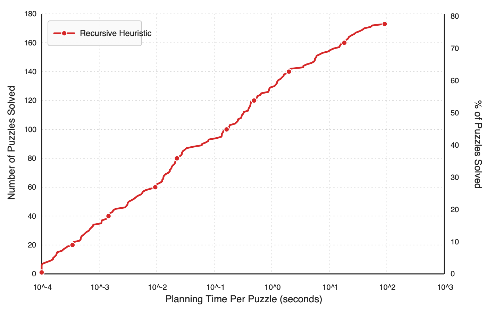

# PushWorld Recursive Heuristic

This repo experiments with a recursive heuristic for Google DeepMind's PushWorld benchmark. It performs better than any classical heuristic previously known.



## What is PushWorld?

PushWorld is basically Sokoban with polyominoes.

- The player moves up, down, left, or right.
- The player can walk into boxes and push them towards their goals.
- The player and boxes can be multi-cell shapes, not just single tiles.
- Boxes are weightless, so one push can move several touching boxes at once.
- Not every box has a target. Some boxes are just tools or obstacles.
- Gates prevent the player from crossing them, but boxes can still move through them.

## Setup

This repo expects the original `pushworld` repo to live next to it, because the recursive solver builds against `../pushworld/cpp`.

Your folders should look like this:

```text
GitHub/
  pushworld/
  pushworld_heuristic/
```

You will need:

- `python3`
- a C++20 compiler available as `c++`
- `ffmpeg` for solution videos

If you do not already have the DeepMind `pushworld` repo checked out, clone it as the sibling `pushworld` directory before running anything here. Their repo is [here](https://github.com/google-deepmind/pushworld).
## Run the recursive heuristic

From this repo, run:

```bash
python3 solve_benchmark.py --solver recursive --time-limit 10
```

That command will reuse the existing recursive binary or build it automatically, then run the benchmark with a 10 second cap per level.

Outputs are written to:

- `heuristic_recursive/solutions/`
- `heuristic_recursive/solutions_video/`
- `heuristic_recursive/solutions/summary.json`

The runner resumes by default. To rerun everything from scratch, add `--no-resume`.

If you only want one difficulty folder, add `--level`, for example:

```bash
python3 solve_benchmark.py --solver recursive --time-limit 10 --level 1
```
